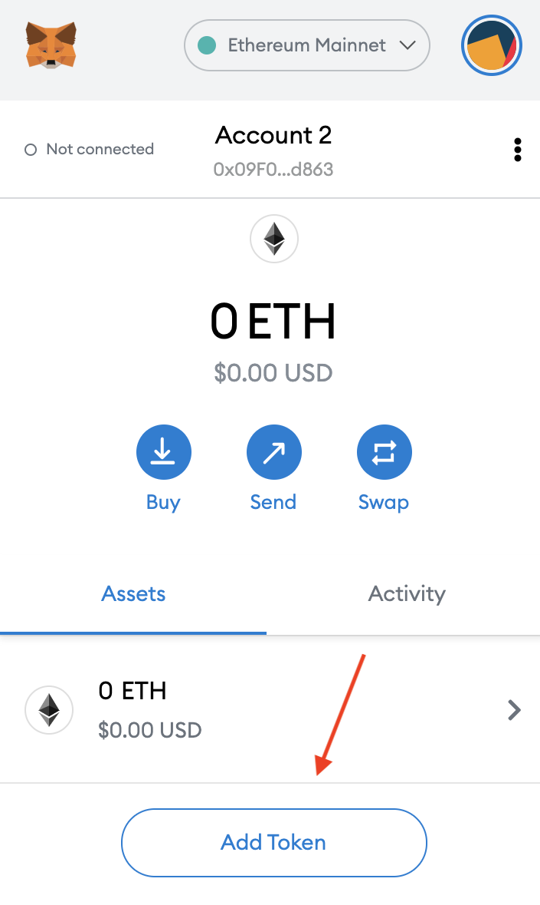
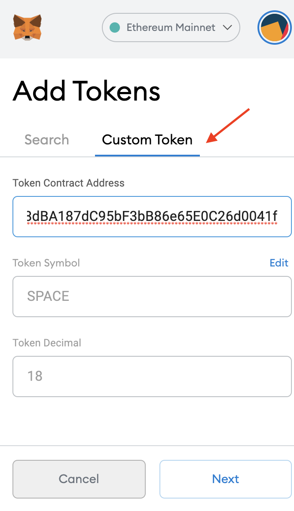

# Finding SPACE tokens in a crypto wallet

SPACE tokens are ERC-20 tokens based on the Ethereum blockchain. Many of the tokens you can find today are also ERC-20 tokens based on Ethereum \(Example of tokens such as USDC, USDT, UNI, LINK, VET, EOS, ZRX, BAT and over 1000 more\).

In order for you to see the [SPACE token](https://spacetoken.spacelens.com/) in your wallet, **you need to have a wallet that can display ERC-20 Tokens.**

You can find here a **list of compatible wallets** that you can download and use for free here \(they are many more that exist\)

* **Spacewallet:** This is the official Spacelens wallet. You can download it on your iPhone [**here**](https://apps.apple.com/tt/app/spacelens-shop-sell-swap/id1456779132)
* **Coinbase Wallet:** This is a software wallet created by Coinbase. You can download it for iPhone or Android [here](https://wallet.coinbase.com/) \(this is not the wallet that you have if you have a Coinbase account on the exchange; it's a standalone wallet\)
* **Trust Wallet:** This is a software wallet owned by Binance. You can download it for iPhone or Android [here](https://trustwallet.com/) \(again, this is not the wallet that you have if you have a Binance account on the exchange; it's a standalone wallet\)

-&gt; These 3 wallets will show you automatically if you have SPACE token or any other ERC-20 tokens in your wallet.

-&gt; Most of the exchanges will not allow for you to see your ERC-20 tokens. You must use a standalone wallet. Never use an Exchange address for Ethereum to receive SPACE tokens or other ERC-20 tokens as you won't be able to interact with them.

### **Metamask** 

[Metamask](https://metamask.io/) will allow to send, receive and hold any ERC-20 tokens. The only difference with the wallets listed above is that it might not display these tokens by default. Do not worry, your tokens are there if you have them but you need to manually add the Tokens to your portfolio in order to see them.

How do you do that? For example in the case of the SPACE tokens \(this will work with any ERC-20 Token\):

1\) Open your Metamask desktop app and click on "Add Token"

2\) Select Custom token and in the case of the SPACE token, copy and add the contract address in the contract address field: **0xcc7ab8d78dBA187dC95bF3bB86e65E0C26d0041f**

3\) Click Next. Your SPACE token will be displayed on your Ethereum wallet**!**

